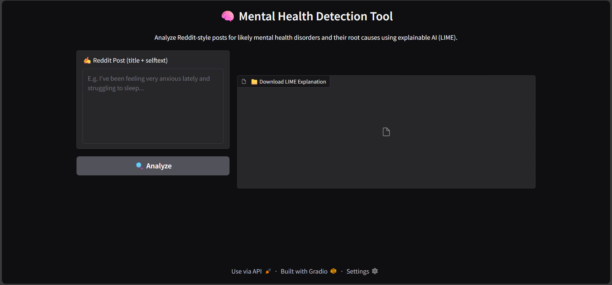
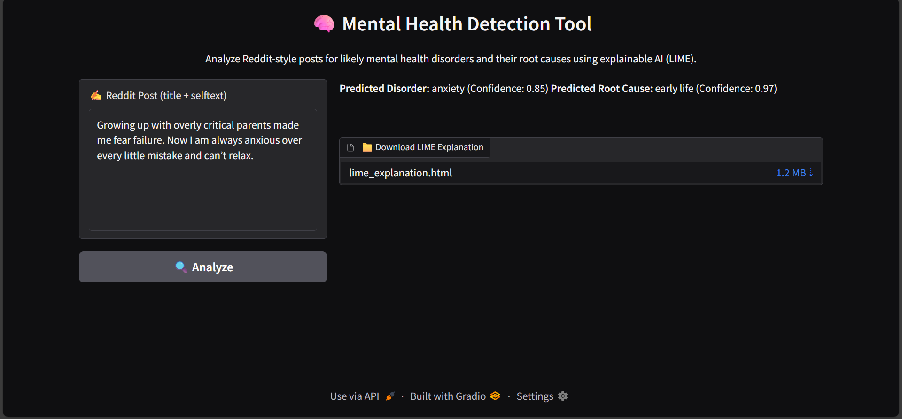
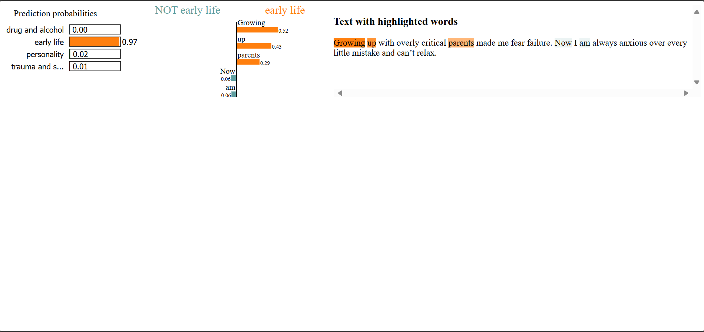

# 🧠 Mental Health Detection Using DistilBERT & Explainable AI (LIME)

This project is a robust mental health analysis tool that uses two fine-tuned DistilBERT models to detect **mental health disorders** and their possible **root causes** from Reddit-style posts. It includes **explainable AI** via LIME to provide users with transparency and interpretability into model decisions.

## 📌 Project Overview

The tool helps users analyze free-form text and receive:
- Predicted **mental health disorder** (e.g., depression, anxiety, lonely, suicidewatch, mentalhealth)
- Probable **root cause** of the issue (e.g., trauma and stress, personality, drug and alcohol, early life)
- **LIME explanations** for model decisions (with HTML visualization + download option)

### This project is built using:
- `Hugging Face Transformers` for NLP pipelines
- `Scikit-learn` for label encoding
- `LIME` for explainability
- `Gradio` for a beautiful, interactive UI

---

## 📂 Folder Structure
MentalHealth Detection/
│

├── app.py # Main Gradio application

├── FinalMentalHealthModel_DistilBERT/ # Fine-tuned model for disorder classification

├── FinalMentalHealthModel_RootCause/ # Fine-tuned model for root cause classification

├── label_encoder_root.pkl # Pickle file for root cause label encoding

├── lime_explanation.html # LIME-generated explanation (auto-saved)

├── screenshots/ # Folder to store app demo screenshots

└── .gitignore

---

## 🛠️ Features

✅ Predicts mental health disorders from Reddit-style text  
✅ Identifies probable root causes of distress  
✅ Returns prediction **confidence scores**  
✅ Generates LIME explanations (visualized and downloadable)  
✅ Clean, intuitive user interface using Gradio    

---

## 📸 Screenshots

> ⚠️ Please add screenshots in the `screenshots/` folder and update the file names below.

### 🧪 Input Page  


### 📊 Prediction Output  


### 🧠 LIME Explanation  


---

## 📥 Installation & Setup

Make sure Python 3.10+ is installed.

```bash
# Clone the repository
git clone https://github.com/Gambi204/mental-health-detection.git
cd mental-health-detection

# Optional: Create and activate virtual environment
python -m venv venv
source venv/bin/activate  # For Windows use: venv\Scripts\activate

# Install dependencies
pip install -r requirements.txt
```

---

## ▶️ Usage

```bash
python app.py
```
Open your browser and navigate to:
http://127.0.0.1:7860


---

## 📁 LIME Explanation
Once a post is analyzed:

-> LIME explanation will be shown inline

-> An HTML file (lime_explanation.html) will be created and available for download

-> You can open the file in any browser for a detailed token-level interpretation

---

## 🔍 Model Details
# 🧠 Model 1 – Disorder Detection
-> Fine-tuned DistilBERT model for classifying posts into mental disorders.

-> Trained on cleaned Reddit mental health text.

# 🔍 Model 2 – Root Cause Detection
-> Second DistilBERT model fine-tuned to identify the underlying cause.

-> Uses label encoding and decoding via label_encoder_root.pkl.

# ✨ Explainability (LIME)
-> Uses LimeTextExplainer from the lime package

-> Provides a local explanation showing top 5 contributing words per post

---

## ✍️ Contributing
This project was developed as part of an academic project. Contributions are welcome! You can help by:

**.** Expanding the dataset

**.** Improving model performance

**.** Exploring deployment options

**.** Enhancing the UI or explanation features

---

## 📝 License
-> MIT License
**.** This project is for academic and demonstration purposes only. Commercial use is not allowed without explicit permission. If you'd like to reuse or extend it, please contact the author or credit accordingly.

---

## 👨‍🎓 Author
**.** Emmanuel Mugambi -> mugambiriungu1@gmail.com

---
